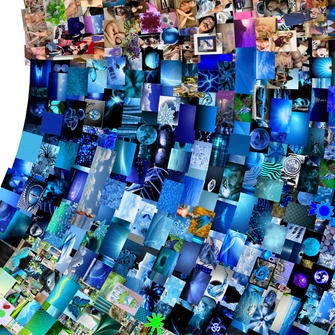
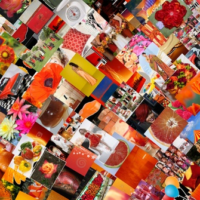
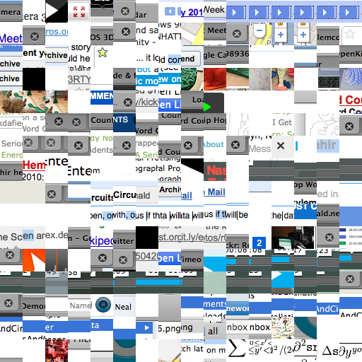
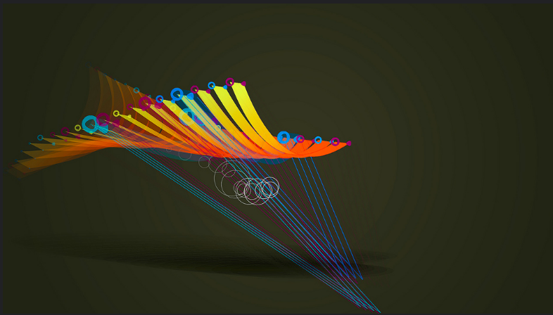
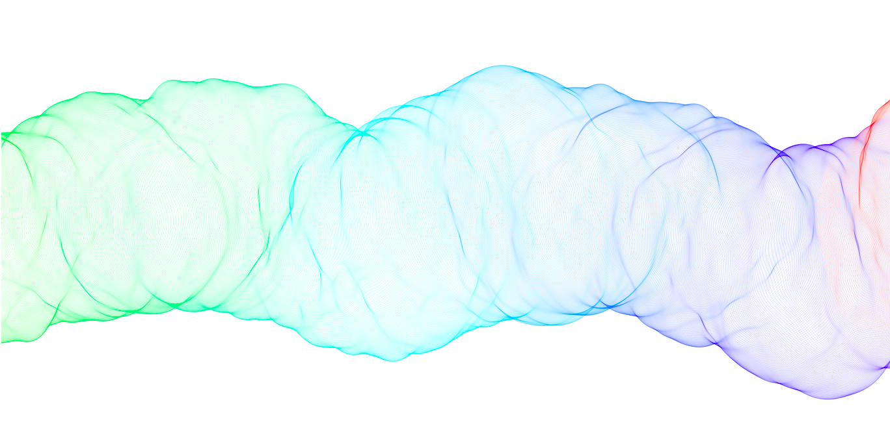
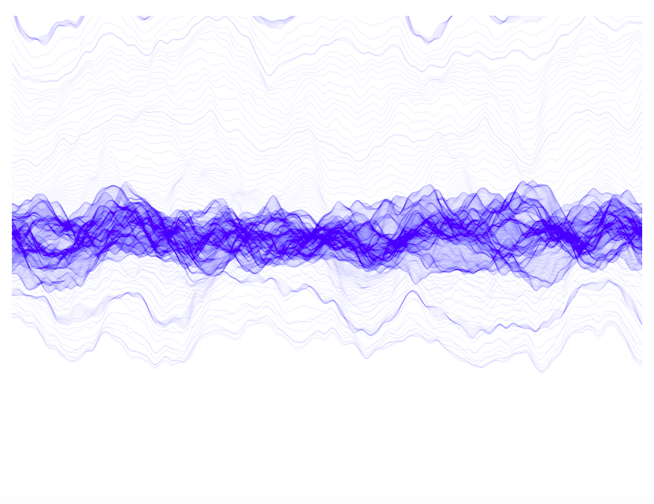

# Week 2 Blog Post

As inspiration for the future graphics projects I selected some artworks that I enjoyed a lot. 

## <Color> Wheel 2012

Work by Jason Salavon Studio

  

  
  

Link: http://salavon.com/work/color-wheel/image/410/

I find this piece to be very interesting, as it plays with the way we see things, our perception of color and the definition of the screens. I find the ability to zoom into artwork very revealing. The colors on the wheel are created by sending a search query to Bing using color terms. While some of the colors return standard images, the author notes that blue and violet yield inappropriate imagery. The original piece is a 54’’ by 54’’ archival print, but online the user automatically zooms into the images. 

## Important Things

By Kyle McDonald on Flickr

  

Link: https://www.flickr.com/photos/kylemcdonald/sets/72157625874470177

This is a project available on Flickr. The author recorded the last 256 clicks, specifically the small window around the point where the mouse was clicked. This images were then connected into one image. I found this project to be very interesting, as it explores our behavior as a user, and can reveal some patterns. I also think that it would be interesting to repeat the experiment and see whether different users would get significantly different results. Unfortunately, there is no interactive part beyond creation of these. 

## Flightpattern

Artwork published on Vimeo by Gwen Vanhee

  

Link: https://vimeo.com/7174318 

This is an artwork originally created in ActionScript. As described by the author, “Audio responsive video exploration, based on audio input, randomness and mouse gestures.”. Therefore, the original video was created as a response to the sound and mouse movements, and at the end we get this amazing cartoon, with interesting geometric transformations. I think that this is a good example of the possibilities for the interactive animation that I find especially appealing. 

# Week 3 Blog Post

For my "hello world" works, I created two animations. One is a simple square and lines, and the other one is stars appearing and forming 'hello world':

  
   

I really enjoyed the process of creating these pieces. I spent the most time of the starry sky, specifically the animation and updating the star locations. This is still work in progress, as I will need to change the way the star locations are saved and processed. It would also be better to make a separate function for drawing the stars from the array. I am still a little confused about the best way to create animations in p5.js. To continue the work I plan to read the Creative coding in p5.js book and practice more with the animation. I also hope to look at the tutorials from the Nature of Code examples for p5js. 

# Week 5 Blog Post

The first piece of art I really like is available online on https://www.openprocessing.org/sketch/408882

Here is a print screen of the resulting image:

  

This code uses random noise() for the changes in shape generation and also a random numebr to set the color. I really enjoy this pieces, as it looks simple and clean, with neat lines and white background. 

The other piece I really enjoey is very similar, and also uses noise(). The versio is available at https://www.openprocessing.org/sketch/431490

The sketch is interactive, but here is something I got after playing with it for some time. 

  

I like the color and the interactivity of the piece and also the simplicity of the code that generated it. 

# Week 6 Blog Post

This project involved using random parameters, fine-tuned with the algorithmic design. Generally, I am comfortable with letting go the control and structure. However, this time I decided not to place the circles in the random positions and rather vary the size randomly and allow the user to add the circles. The size of the bend in the circle also is picked randomly. 

Originally I wanted to do the lines moving out more randomly, emanating from the center. But I found out that the more consistent development produces a more pleasant design. So in a way, a more random process did not produce a good image. 

# Week 8 Blog Post

  
   

One of the visualizations I really like is called the Iraq's Bloody Toll by Simon Scarr. Through a creative use of a bar plot the author created a very interesting effect. I like the simplicity behind the plot - it is relatively simple to create a bar chart, but at the same time it is not easy to create a striking feeling behind it. The metaphor of the blood works really well (of cause, in a way the data is also shaped well). It takes a skillful eye to see a possibility here. 

Another set of visualizations I find interesting come from a Wall Street Journal article "Battling Infectious Diseases in the 20th Century: The Impact of Vaccines". These shows the imapact of the vaccination on the number of sickness cases cases. Here, I like that the viewer can make a conclusion and see the effects right away, almost without looking at the legends or addicitional information. It is clear, uses good color and understandable from the first glance. (It is also interactive on hovering)
http://graphics.wsj.com/infectious-diseases-and-vaccines/

# Week 11: Connecting things

  

One of the artworks I selected for the "Connecting things" is a temporary public installation in he City of San Jose, California *Abudance* by ZER01 – the Art and Technology Network. A video camera captures the movement of the visitors of the plaza, which is later analyzed and projected as animation onto the 3-story cylindrical rotunda. This animation, flowing, warm and humanizing transforms the strict and bold rotunda. Participants can locate themselves (or their representation) on the projection, making it a collective art, and rotunda - a canvas for it. 

